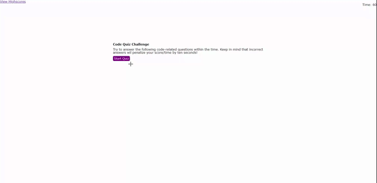

# Code Quiz

## Description

A Greek mythology themed quiz created using HTML, CSS, and JavaScript. You score is the time you have left in the quiz so try to complete it as fast as you can. However, make sure you get answers right otherwise you'll lose 15 seconds for every wrong answer. Check it out at the link below!

## Website

[Here!](https://ezequielmejiasmelo.github.io/code-quiz/)

## Languages

- HTML
- CSS
- JavaScript

## Support

Contact me if you have any questions

- [LinkedIn](https://www.linkedin.com/in/ezequiel-mejias-melo)
- [Github](https://github.com/EzequielMejiasMelo)